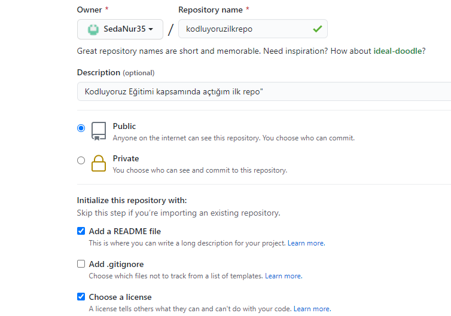

# kodluyoruzilkrepo
 Bu repo [kodluyoruz](https://www.kodluyoruz.org/) Front-End Eğitiminde oluşturduğumuz ilk repo İçerisinde bir adet README dosyası, bir adet de index.html barındırıyor.

 # Installation
 Öncelikle projeyi clonelayın. (Buraya sizin reponuzdan aldığınız link gelecek)

 ` git clone https://github.com/cengizcmataraci/kodluyoruzilkrepo.git `

 # Usage
 Linux için: 
   ` cd kodluyoruzilkrepo `

    ` code .` 

 # Contributing
 Pull requestler kabul edilir. Büyük değişiklikler için, lütfen önce neyi değiştirmek istediğinizi tartışmak için bir konu açınız.
